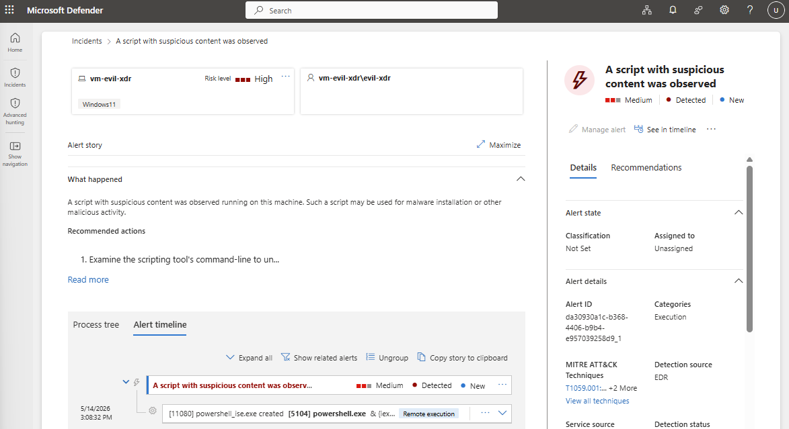
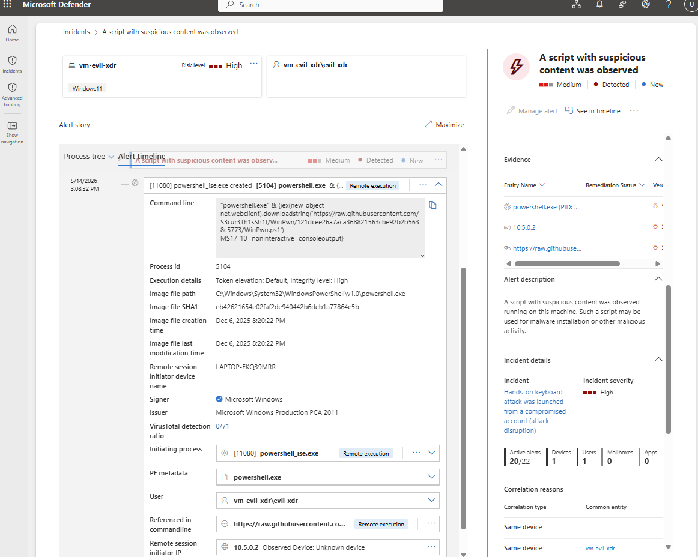

# Defender-XDR-Execution-Lab
Microsoft Defender XDR incident investigation focusing on Execution (MITRE ATT&amp;CK TA0002)
Microsoft Defender XDR Investigation: Suspicious PowerShell Execution
Overview

As part of the Defending Azure learning path, I investigated a Microsoft Defender XDR incident involving suspicious PowerShell activity on a Windows 11 endpoint. The exercise focused on alert triage, process analysis, and understanding how Defender XDR correlates telemetry to assess incident risk.

The investigation aligned closely with typical SOC analyst responsibilities, including reviewing alerts, analyzing process trees, identifying potentially malicious behavior, and evaluating containment options.

Incident Summary

Microsoft Defender XDR generated an alert titled "A script with suspicious content was observed" on the device vm-evil-xdr.
## Alert Overview

Key Details

Device: vm-evil-xdr
User: vm-evil-xdr\evil-xdr
Detection Source: Microsoft Defender for Endpoint (EDR)
Technique: PowerShell (MITRE ATT&CK T1059.001)
Alert Severity: Medium
Incident Risk Level: High

The alert was triggered when PowerShell executed a remote download-and-execute command, a common fileless attack technique frequently used by adversaries to avoid traditional file-based detection mechanisms.

## Investigation Process
### Alert timeline

The investigation began by reviewing the Defender XDR process tree. The initiating process, powershell_ise.exe, spawned a child powershell.exe process that executed a remote PowerShell script directly from a public GitHub repository.

The command leveraged:

Invoke-Expression (IEX)
Net.WebClient.DownloadString()

This pattern is commonly known as a PowerShell download cradle, where a script is retrieved from an external source and executed entirely in memory without being written to disk.

Command Analysis

The downloaded content originated from the WinPwn framework, an offensive security toolkit commonly used during penetration testing and security assessments.

While WinPwn has legitimate use cases, its capabilities include:

Privilege escalation discovery
Active Directory enumeration
Credential harvesting activities
Security misconfiguration identification

Because these capabilities overlap with attacker tradecraft, execution of the framework generated a Defender XDR alert.

Remote Session Context

Additional investigation revealed that the PowerShell activity originated from a remote session associated with:

Source Device: LAPTOP-FKQ39MRR
Source IP: 10.5.0.2

This finding expanded the scope of the investigation beyond the affected endpoint and identified another system requiring review.

From an incident response perspective, identifying the source of remote execution is critical because it helps determine whether activity originated from a legitimate administrator, a penetration tester, or a potentially compromised host.

## Severity vs. Risk Assessment

One of the key lessons from this investigation was understanding the difference between alert severity and incident risk level.

The PowerShell download cradle itself was classified as Medium severity because it represents a known and commonly detected technique.

However, Defender XDR assigned the incident a High risk level due to contextual factors including:

High-integrity process execution
Remote session involvement
Potential access to additional systems
Increased opportunity for lateral movement

This demonstrates how effective triage requires evaluating both the technical behavior and the broader operational context.

## Potential Response Actions

Following validation of suspicious activity, several containment and investigation actions were available through Microsoft Defender XDR:

Isolate the affected device
Initiate automated investigation and response
Collect a forensic investigation package
Restrict application execution
Launch a live response session
Conduct environment-wide hunting for related indicators

These actions support rapid containment and help prevent further attacker activity within the environment.

## Key Takeaways
Performed alert triage and investigation using Microsoft Defender XDR.
Analyzed PowerShell execution associated with MITRE ATT&CK T1059.001.
Investigated a fileless execution technique using a PowerShell download cradle.
Evaluated the significance of remote execution activity and process lineage.
Strengthened understanding of the difference between alert severity and incident risk.
Practiced translating technical findings into actionable security observations.

## Skills Demonstrated

- Microsoft Defender XDR
- Incident Triage
- MITRE ATT&CK Mapping
- PowerShell Analysis
- Process Tree Investigation
- Threat HuntingSecurity Documentation

## References
TryHackMe – XDR: Execution
TryHackMe – Defending Azure Path
Microsoft Defender XDR Documentation
MITRE ATT&CK Framework (T1059.001)
